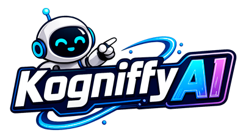
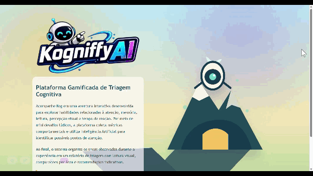
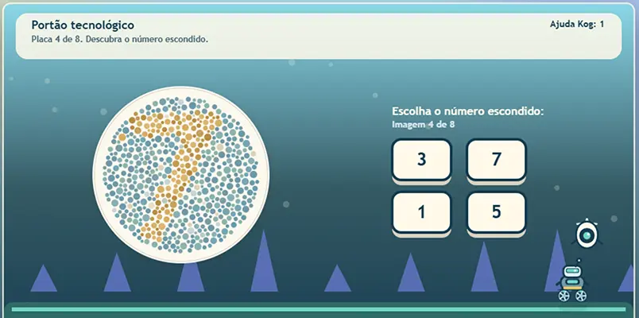
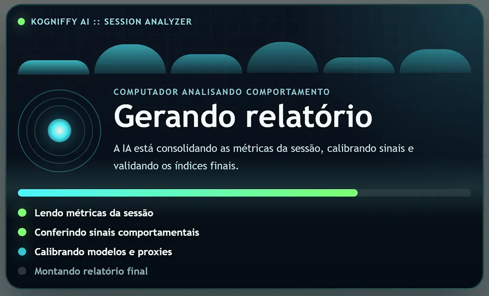
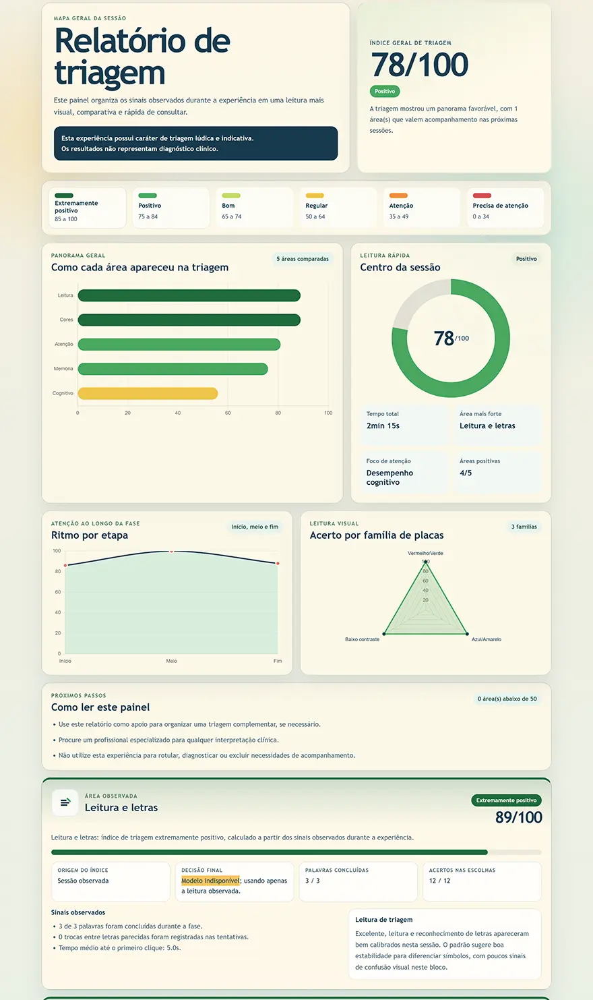

# Kogniffy AI

Kogniffy AI is a gamified cognitive screening platform that turns interactive challenges into behavioral signals for AI-assisted analysis. The experience is designed to observe how the player responds to tasks involving reading patterns, color perception, attention shifts, short-term memory, reaction time, and decision-making under simple game conditions.

At the end of each session, the platform organizes the collected metrics into a visual triage report with area-by-area breakdowns, session evidence, and indicative recommendations. The result is meant to support observation and follow-up, not to replace professional evaluation or produce a clinical diagnosis.

## Project Status

The current version is already playable end to end: the landing page, intro flow, mini-games, session metric capture, report generation, and model-backed analysis pipeline are implemented and available in the live build. The project is still evolving in its local training and calibration workflow, with ongoing improvements to datasets, model artifacts, and score resolution logic.

## Live Demo

[Live Demo](https://kogniffy-ai.vercel.app)

The public build allows the full experience to be explored in the browser, from the game session to the final report flow. During the activities, trained models are used to analyze cognitive behavior through gameplay signals such as response patterns, attention shifts, memory performance, visual discrimination, and reaction timing.



## Mini-Games and Behavioral Analysis

The platform is structured as a sequence of mini-games that translate player actions into measurable cognitive and behavioral signals. Each phase focuses on a different interaction pattern, such as reading accuracy, letter confusion, color and contrast recognition, sustained attention, impulsive responses, memory span, and reaction consistency.

During gameplay, the system captures details such as response times, hesitation, corrections, missed targets, repeated errors, automatic assistance events, and phase-specific performance indicators. These signals are later consolidated to build the final triage reading.



## Model Application During Report Generation

When a session ends, Kogniffy AI processes the observed metrics through heuristics, calibrated proxies, and TensorFlow.js model artifacts to assemble the final report. This stage combines the raw gameplay evidence with trained model outputs so the system can transform in-game behavior into indicative scores for the evaluated areas.

The report flow also validates which score source should be surfaced for each category, balancing direct session evidence with model-backed interpretation when compatible artifacts are available.



## Observation Points Displayed in the Report

The report highlights the main observation points from the session in a fast visual format. This includes the overall triage score, area-by-area comparisons, trend views for attention rhythm, color-family performance, strongest areas, points that deserve closer observation, and session evidence attached to each category.

The current report structure covers reading and letters, colors and contrast, attention, memory/reaction, and broader cognitive performance. It also summarizes total session time, positive areas, areas under watch, and guidance on how to interpret the session output without treating it as a diagnosis.



## Technology Stack

- Next.js 15
- React 19
- TypeScript
- Node.js
- pnpm
- TensorFlow.js
- Chart.js
- Canvas API
- SVG
- CSS Modules

## Model Training

The model training workflow is local and script-driven. The current training setup uses datasets sourced from the [Kaggle Datasets catalog](https://www.kaggle.com/datasets), then adapts those files to the feature space used by the game and report pipeline.

The repository already includes training flows for:

- Dyslexia-related reading signals
- Color vision and contrast recognition
- Attention analysis with an ADHD-oriented proxy model
- Cognitive performance scoring
- Reaction time classification

Local raw datasets are stored under `data/raw/`, and trained artifacts are written to `models/`. In practice, the training scripts normalize the source data, derive game-compatible features, train TensorFlow.js models, and persist the artifacts consumed by the browser report flow.

## Running the Project

### Prerequisites

- Node.js
- pnpm or npm

The project uses `pnpm` as the default package manager, but the same scripts can also be executed with `npm`.

### Install dependencies

With `pnpm`:

```bash
pnpm install
```

With `npm`:

```bash
npm install
```

### Start the development server

With `pnpm`:

```bash
pnpm dev
```

With `npm`:

```bash
npm run dev
```

Open `http://localhost:3000`.

### Production build

With `pnpm`:

```bash
pnpm build
pnpm start
```

With `npm`:

```bash
npm run build
npm start
```

## Useful Commands

Using `pnpm`:

```bash
pnpm lint
pnpm train:model ./data/kogniffy-training.csv
pnpm train:dyslexia ./data/raw/dyslexia/dyslexia.csv
pnpm train:adhd ./data/raw/adhd/adhdata.csv
pnpm generate:colorblind
pnpm train:colorblind ./data/raw/colorblind/sessions.csv
pnpm validate:colorblind-plates
pnpm train:cognitiveperformance ./data/raw/cognitiveperformance/human_cognitive_performance.csv
pnpm train:reactiontime ./data/raw/reactiontime/reaction_time_dataset.csv
pnpm validate:models
```

Using `npm`:

```bash
npm run lint
npm run train:model -- ./data/kogniffy-training.csv
npm run train:dyslexia -- ./data/raw/dyslexia/dyslexia.csv
npm run train:adhd -- ./data/raw/adhd/adhdata.csv
npm run generate:colorblind
npm run train:colorblind -- ./data/raw/colorblind/sessions.csv
npm run validate:colorblind-plates
npm run train:cognitiveperformance -- ./data/raw/cognitiveperformance/human_cognitive_performance.csv
npm run train:reactiontime -- ./data/raw/reactiontime/reaction_time_dataset.csv
npm run validate:models
```

## Runtime Notes

- `/` is the landing page with the intro modal and entry point to the game.
- `/game` runs the interactive session.
- `/report` renders the final triage report from the session snapshot.
- Session metrics are collected locally during gameplay and then reused by the report page.
- Local training is separate from the deployed gameplay flow.
- `@tensorflow/tfjs-node` is optional and only useful for faster local training in compatible environments.

## Repository Overview

- `app/page.tsx` for the landing page
- `app/game/page.tsx` for the game route
- `app/report/page.tsx` for the final report
- `src/game/` for scenes, entities, UI, and engine logic
- `src/metrics/` for session metric collection
- `src/ai/` for heuristics, feature builders, model loading, and predictions
- `src/report/` for report assembly and score presentation
- `scripts/` for local training, validation, and asset generation utilities

## Important Note

Kogniffy AI provides an indicative screening experience based on observed in-session behavior. Its outputs should be interpreted as structured observation signals and not as a medical, psychological, neurological, or clinical diagnosis.
